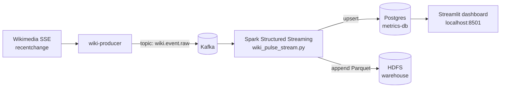

# Wiki Pulse Analytics

Watch **live Wikipedia activity** in a web dashboard. A small but complete streaming pipeline: events flow from Wikimedia's public feed, into Kafka, through Spark Structured Streaming, into Postgres, and onto a Streamlit dashboard.



---

## Quickstart

```bash
docker compose up -d
# Wait ~1–2 minutes the first time for Kafka and metrics-db to become healthy, then follow **Run the pipeline** below.
```

You need **Docker** and roughly **8 GB free RAM**. Ports `8501` (dashboard), `9085` (Kafka UI), `9870` (HDFS UI), `4040` (Spark UI), and `55432` (Postgres) must be free.

All operational steps below use **`docker compose`** from the **repository root** (where `docker-compose.yml` lives). On Windows, use **PowerShell**, **WSL**, or **Git Bash** the same way.

---

## Run the pipeline

Spark streaming does **not** start with `docker compose up -d` alone. If the driver exits (crash, reboot, manual stop), run this section again (use **Stop Spark streaming** first if a process is still stuck).

**1) Executable launcher on the host** (bind mount):

```bash
chmod +x my_code/scripts/run_spark_stream.sh
```

**2) HDFS directories + lookup CSV** (Spark fails fast if the CSV is missing):

```bash
docker compose exec -T main-bigdata-service bash -eo pipefail -c "
  hdfs dfs -mkdir -p /data/static \
    /user/cloudera/wiki_pulse/checkpoints/main \
    /user/cloudera/wiki_pulse/checkpoints/action_by_type \
    /user/cloudera/wiki_pulse/warehouse/wiki_window_agg
  if ! hdfs dfs -test -f /data/static/wiki_domains.csv 2>/dev/null; then
    hdfs dfs -put -f /opt/my_code/static/wiki_domains.csv /data/static/wiki_domains.csv
  fi
"
```

**3) (Optional) Restart the producer** for a fresh Wikimedia SSE → Kafka connection:

```bash
docker compose restart wiki-producer
docker compose logs wiki-producer --tail 20
```

**4) Start Spark in the background** — default consumes **new** Kafka messages only (`KAFKA_STARTING_OFFSETS` defaults to `latest` in the driver). If Spark is already running and you want a clean restart, do **Stop Spark streaming** first.

```bash
docker compose exec -d main-bigdata-service bash -lc \
  'mkdir -p /opt/my_code/logs && nohup /opt/my_code/scripts/run_spark_stream.sh >> /opt/my_code/logs/spark_streaming.log 2>&1 &'
```

To **replay the whole Kafka topic** (typical right after **Reset rollups and replay from Kafka**), use `earliest` once:

```bash
docker compose exec -d -e KAFKA_STARTING_OFFSETS=earliest main-bigdata-service bash -lc \
  'mkdir -p /opt/my_code/logs && nohup /opt/my_code/scripts/run_spark_stream.sh >> /opt/my_code/logs/spark_streaming.log 2>&1 &'
```

**5) Wait 1–3 minutes**, then check rollups and open the dashboard:

```bash
docker compose exec -T metrics-db psql -U wikipulse -d wiki_pulse_metrics -c \
  "SELECT COUNT(*) AS rollup_minute_rows FROM rollup_minute;"
```

Open http://localhost:8501

### If `rollup_minute_rows` never grows

Spark does **not** start with `docker compose up -d` alone (container restart, host reboot, or manual stop all leave Spark off until you run **step 4** again). Confirm the driver is running:

```bash
docker compose exec -T main-bigdata-service bash -lc \
  'ps aux | grep -E "[r]un_spark_stream.sh|[w]iki_pulse_stream.py|[S]parkSubmit.*wiki_pulse"'
```

You should see `run_spark_stream.sh`, `SparkSubmit … wiki_pulse_stream.py`, or `python3 …/wiki_pulse_stream.py`. If the command prints nothing, run **step 4** (and **steps 1–2** if this is a fresh volume). Then wait **2–4 minutes** (30 s trigger + 1 minute window + watermark) and recheck:

```bash
docker compose exec -T metrics-db psql -U wikipulse -d wiki_pulse_metrics -c \
  "SELECT COUNT(*) AS rows, MAX(updated_at) AS last_upsert FROM rollup_minute;"
```

`last_upsert` should advance when Spark is healthy.

---

## Stop Spark streaming

Stops the launcher shell, `spark-submit`, and the Python driver for `wiki_pulse_stream.py` inside `main-bigdata-service` (data in Postgres and Kafka is kept).

```bash
docker compose exec -T main-bigdata-service bash -s <<'EOS'
set -eu
for pid_dir in /proc/[0-9]*; do
  pid="${pid_dir#/proc/}"
  case "$pid" in *[!0-9]*) continue ;; esac
  cmd=$(tr '\0' ' ' <"$pid_dir/cmdline" 2>/dev/null || true)
  [[ -z "$cmd" ]] && continue
  case "$cmd" in
    *run_spark_stream.sh*)
      kill -TERM "$pid" 2>/dev/null || true ;;
    *SparkSubmit*|*spark-submit*)
      printf '%s' "$cmd" | grep -q '[w]iki_pulse_stream' && kill -TERM "$pid" 2>/dev/null || true ;;
    *python*|*Python*)
      [[ "$cmd" == *'/opt/my_code/spark/wiki_pulse_stream.py'* ]] && kill -TERM "$pid" 2>/dev/null || true ;;
  esac
done
sleep 2
for pid_dir in /proc/[0-9]*; do
  pid="${pid_dir#/proc/}"
  case "$pid" in *[!0-9]*) continue ;; esac
  cmd=$(tr '\0' ' ' <"$pid_dir/cmdline" 2>/dev/null || true)
  case "$cmd" in
    *run_spark_stream.sh*|*SparkSubmit*|*spark-submit*|*wiki_pulse_stream*)
      kill -KILL "$pid" 2>/dev/null || true ;;
  esac
done
ps -eo pid,cmd --width 240 | grep -E '[r]un_spark_stream.sh|[w]iki_pulse_stream|[S]parkSubmit' || true
EOS
```

Resume later with **Run the pipeline** again.

---

## Reset rollups and replay from Kafka

Wipes `rollup_minute` / `rollup_action_minute` in metrics Postgres, deletes Spark checkpoints and the Parquet warehouse on HDFS, then you start Spark with **`KAFKA_STARTING_OFFSETS=earliest`** (see **Run the pipeline** step 4).

**1) Stop Spark** — **Stop Spark streaming** above.

**2) Truncate rollup tables:**

```bash
docker compose exec -T metrics-db psql -U wikipulse -d wiki_pulse_metrics -v ON_ERROR_STOP=1 -c \
  "TRUNCATE TABLE rollup_minute, rollup_action_minute;"
```

**3) Remove HDFS checkpoint + warehouse paths** (defaults match the app; change paths if you overrode `WIKIPULSE_CHECKPOINT`, `WIKIPULSE_CHECKPOINT_ACTION`, or `WIKIPULSE_HIVE_WAREHOUSE`):

```bash
docker compose exec -T main-bigdata-service bash -lc "
  set -e
  for p in /user/cloudera/wiki_pulse/checkpoints/main \
           /user/cloudera/wiki_pulse/checkpoints/action_by_type \
           /user/cloudera/wiki_pulse/warehouse/wiki_window_agg; do
    hdfs dfs -rm -r -f \"\$p\" || true
  done
  hdfs dfs -mkdir -p /user/cloudera/wiki_pulse/checkpoints/main \
    /user/cloudera/wiki_pulse/checkpoints/action_by_type \
    /user/cloudera/wiki_pulse/warehouse/wiki_window_agg
"
```

**4) Run the pipeline** using the **`earliest`** `docker compose exec` line in **Run the pipeline** step 4.

---

## Diagnose the stack

Use these when the dashboard is empty, stale, or something fails after an upgrade.

**Container status**

```bash
docker compose ps
```

**Spark process** (expect `run_spark_stream.sh`, `wiki_pulse_stream.py`, or `SparkSubmit` for this app)

```bash
docker compose exec -T main-bigdata-service bash -lc \
  'ps aux | grep -E "[r]un_spark_stream.sh|[w]iki_pulse_stream.py|[S]parkSubmit.*wiki_pulse_stream"'
```

**Spark driver log** (last 200 lines)

```bash
docker compose exec -T main-bigdata-service tail -n 200 /opt/my_code/logs/spark_streaming.log
```

**Producer**

```bash
docker compose logs wiki-producer --tail 100
```

**Kafka end offsets for `wiki.event.raw`**

```bash
docker compose exec -T kafka sh -lc \
  'kafka-run-class kafka.tools.GetOffsetShell --broker-list kafka-server:9092 --topic wiki.event.raw --time -1'
```

**Rollup count and freshness**

```bash
docker compose exec -T metrics-db psql -U wikipulse -d wiki_pulse_metrics -c \
  "SELECT COUNT(*) FROM rollup_minute;"
docker compose exec -T metrics-db psql -U wikipulse -d wiki_pulse_metrics -c \
  "SELECT NOW(), MAX(updated_at), MAX(window_end) FROM rollup_minute;"
```

**Dashboard HTTP**

```bash
curl -sfS -o /dev/null --max-time 5 http://127.0.0.1:8501/ && echo OK
```

**Last Spark driver problem** (Python tracebacks and log4j **ERROR**/**FATAL** lines)

Many **WARN** lines are normal (for example `HDFSBackedStateStoreProvider` “state for version … doesn't exist in loadedMaps” on startup batches, or `DataStreamer` / `InterruptedException` during HDFS writes). Do **not** treat those as failures. Older snippets matched the word `Exception` anywhere and surfaced harmless `InterruptedException` stack traces.

```bash
docker compose exec -T main-bigdata-service bash -lc '
  log=/opt/my_code/logs/spark_streaming.log
  test -f "$log" || { echo "(no log)"; exit 0; }
  match=$(grep -nE ",[0-9]+ ERROR |,[0-9]+ FATAL |Traceback|ImportError:|RuntimeError:|Py4JJavaError|StreamingQueryException|QueryExecutionException" "$log" | tail -n 1 | cut -d: -f1)
  if test -n "$match"; then start=$((match>5?match-5:1)); end=$((match+25)); sed -n "${start},${end}p" "$log"; else echo "(no matching driver error lines — WARN noise is common; see text above)"; fi
'
```

---

## Command cheat sheet

| Goal | Where |
|---|---|
| Start containers | `docker compose up -d` |
| Start Spark + prerequisites | **Run the pipeline** |
| Stop Spark only | **Stop Spark streaming** |
| Wipe rollups + HDFS state + replay Kafka | **Reset rollups and replay from Kafka** |
| Debug | **Diagnose the stack** |
| Full shutdown | `docker compose down` |

---

## Ports and where things live

| URL | What |
|---|---|
| http://localhost:8501 | Streamlit dashboard (main entry point) |
| http://localhost:9085 | Kafka UI (browse topics + consumer groups) |
| http://localhost:9870 | HDFS NameNode UI |
| http://localhost:4040 | Spark Streaming UI (only while Spark runs) |
| localhost:55432 | Postgres `wiki_pulse_metrics` (rollup tables for the dashboard) |
| localhost:5432 | Hive metastore Postgres — **not** the dashboard DB |

Inside the `wikipulse_net` Docker network the hostnames are `kafka-server:9092`, `metrics-db:5432`, `main-bigdata-service`, and `zookeeper-server:2181`.

---

## How it works

| Stage | Code | Role |
|---|---|---|
| Ingest | [`my_code/producer/producer.py`](my_code/producer/producer.py) | Reads Wikimedia SSE feed, writes JSON to Kafka topic `wiki.event.raw`. Acks-all + idempotence-lite for safety. |
| Process | [`my_code/spark/wiki_pulse_stream.py`](my_code/spark/wiki_pulse_stream.py) | Two parallel structured streaming queries; broadcast-joins to a small lookup CSV on HDFS; minute-windowed counts; writes upserts to Postgres and Parquet to HDFS. |
| Schemas | [`my_code/schemas/metrics_init.sql`](my_code/schemas/metrics_init.sql) | `rollup_minute` (totals) + `rollup_action_minute` (per `type` / minor) — both indexed for the staleness probe. |
| Dashboard | [`my_code/dashboard/app.py`](my_code/dashboard/app.py) | Streamlit, auto-refreshing every `STREAMLIT_REFRESH_SECS` (default 15 s). |
| Spark launcher | [`my_code/scripts/run_spark_stream.sh`](my_code/scripts/run_spark_stream.sh) | One-shot: ensures HDFS paths + lookup CSV, tries `psycopg2` install if missing, then `spark-submit` of `wiki_pulse_stream.py` inside `main-bigdata-service`. Start it with **Run the pipeline** in this README; if the driver stops, run **Stop Spark streaming** then **Run the pipeline** again. |

Static enrichment file: [`my_code/static/wiki_domains.csv`](my_code/static/wiki_domains.csv) — uploaded to `hdfs:///data/static/wiki_domains.csv` on first start.

API reference for the SSE payload: [`wiki-apidoc-for-stream.json`](wiki-apidoc-for-stream.json).

---

## Configuration (environment variables)

### Producer

| Var | Default | Notes |
|---|---|---|
| `KAFKA_ACKS` | `all` | `1` is faster but loses data on broker crash. |
| `KAFKA_COMPRESSION` | `snappy` | `gzip` for smaller payloads at higher CPU; `lz4`, `none` also valid. |
| `KAFKA_ENABLE_IDEMPOTENCE` | `true` | Limits in-flight requests to 1 to preserve ordering on retry. Disable for higher throughput. |
| `KAFKA_LINGER_MS`, `KAFKA_BATCH_SIZE` | `20`, `32768` | Bigger batches = higher throughput, more latency. |
| `PRODUCER_HEARTBEAT_SECS` | `30` | INFO heartbeat with running totals; `0` to silence. |
| `PRODUCER_FLUSH_EVERY_SECS` | `10` | Bounded loss window if the container is killed. |

### Spark

| Var | Default | Notes |
|---|---|---|
| `KAFKA_STARTING_OFFSETS` | `latest` | `earliest` once after a reset to replay the topic. |
| `WIKIPULSE_TRIGGER` | `30 seconds` | Micro-batch cadence. |
| `WIKIPULSE_WINDOW` | `1 minute` | Aggregation window. |
| `WIKIPULSE_WATERMARK` | `2 minutes` | Late-arrival tolerance. |
| `KAFKA_MAX_OFFSETS_PER_TRIGGER` | `50000` | Cap per micro-batch (back-pressure). |
| `SPARK_SQL_SHUFFLE_PARTITIONS` | `8` | Bump to 64+ on a real cluster. |
| `SPARK_RUNTIME_VERSION` | `3.1.2` | Must match the Spark in the lab image; sets the `spark-sql-kafka` package version. |

### Dashboard

| Var | Default | Notes |
|---|---|---|
| `STREAMLIT_REFRESH_SECS` | `15` | UI auto-refresh interval. Hot queries cached just below this. |
| `WIKIPULSE_DASHBOARD_LOOKBACK_MINUTES` | `10080` (7 days) | Main chart's `window_end` filter. |
| `WIKIPULSE_DASHBOARD_STALE_MINUTES` | `15` | Banner threshold for "Spark may have stopped". |

---

## Scaling guide

The defaults target a laptop. When data volume goes up, change knobs in this order:

1. **Kafka throughput**. Raise `KAFKA_NUM_PARTITIONS` in [`docker-compose.yml`](docker-compose.yml) (default `3`, comfortable up to `12` even single-broker). Increase `KAFKA_LOG_RETENTION_BYTES` so the buffer can absorb backpressure. For a multi-broker cluster, raise `KAFKA_DEFAULT_REPLICATION_FACTOR` and `KAFKA_MIN_INSYNC_REPLICAS` to 3 / 2.
2. **Producer throughput**. Set `KAFKA_ENABLE_IDEMPOTENCE=false` and `KAFKA_LINGER_MS=50` for batched throughput. Keep `snappy` compression.
3. **Spark parallelism**. Set `SPARK_SQL_SHUFFLE_PARTITIONS=64` (or `2 * number_of_kafka_partitions`). Raise `KAFKA_MAX_OFFSETS_PER_TRIGGER` (e.g., `500000`) so each trigger does more work without falling behind. Set `WIKIPULSE_TRIGGER=10 seconds` for tighter latency.
4. **Postgres**. The schema already has indexes on `(window_end DESC)` and `(updated_at DESC)`. If `rollup_minute` grows past ~50M rows, switch it to a declaratively partitioned table by month and drop the un-indexed scan paths.
5. **Dashboard**. Keep `WIKIPULSE_DASHBOARD_LOOKBACK_MINUTES` modest (a few hours) on a busy DB; the cached fetchers fall back automatically.

`spark.sql.streaming.metricsEnabled=true` is on by default, so Prometheus can scrape per-query metrics on the Spark driver.

---

## Troubleshooting

| Symptom | Try |
|---|---|
| `rollup_minute` row count flat / `last_upsert` old | Spark is probably **not running**. Check with **Run the pipeline** → *If rollup_minute_rows never grows*. After `docker compose up` or reboot you must launch Spark again (step 4). |
| `port is already allocated` | Another process is using one of the ports listed above. |
| `docker compose ps wiki-producer` keeps restarting | `docker compose logs wiki-producer --tail 50`. Most often Kafka isn't healthy yet — wait, or check `docker compose logs kafka`. |
| `rollup_action_minute` missing on an older volume | `docker compose exec -T metrics-db psql -U wikipulse -d wiki_pulse_metrics < my_code/schemas/metrics_addon_rollups.sql`, then **Run the pipeline** (restart Spark). |
| Spark log shows `Lookup CSV missing on HDFS` | **Run the pipeline** step 2 uploads from `/opt/my_code/static/wiki_domains.csv`. `run_spark_stream.sh` also tries on each launch. If the file is missing, the bind mount in `docker-compose.yml` is broken. |
| Spark log shows WARN `HDFSBackedStateStoreProvider` / `InterruptedException` | Usually **normal** (state store loading, HDFS client lifecycle). Use the **Last Spark driver problem** snippet in **Diagnose the stack**—it ignores generic `Exception` so benign Java traces are not mistaken for failures. |
| Spark log shows real `ERROR` / `Traceback` | Read the block printed by **Last Spark driver problem**; fix the root cause, then **Stop Spark streaming** and **Run the pipeline** again. |
| Producer reconnect spam | Wikimedia SSE has intermittent disconnects; the producer reconnects with backoff — normal. |
| Two Postgres databases confuse you | `metrics-db` (port `55432`, DB `wiki_pulse_metrics`) is the rollup store. `postgres-db` (port `5432`, DB `hive_metastore`) is Hive's metastore — never write rollups there. |

Need a deeper view: `docker compose exec main-bigdata-service tail -f /opt/my_code/logs/spark_streaming.log`, or open the Spark UI at http://localhost:4040 while the job runs.

---

## Optional: register Hive tables for the Parquet files

Only useful for course/lab reports that need SQL over the Parquet partitions Spark writes to `hdfs:///user/cloudera/wiki_pulse/warehouse/wiki_window_agg`:

```bash
docker compose exec main-bigdata-service beeline \
  -u jdbc:hive2://localhost:10000 -n hive -p hivepassword \
  -f /opt/my_code/schemas/hive_ddl.sql

docker compose exec main-bigdata-service beeline \
  -u jdbc:hive2://localhost:10000 -n hive -p hivepassword \
  -e "USE wiki_pulse; MSCK REPAIR TABLE wiki_window_agg;"
```

---

## Project layout

```
├── docker-compose.yml
├── README.md
├── wiki-apidoc-for-stream.json
└── my_code/
    ├── producer/         producer.py + Dockerfile + requirements.txt
    ├── dashboard/        app.py + Dockerfile + requirements.txt
    ├── spark/            wiki_pulse_stream.py + requirements-driver.txt
    ├── static/           wiki_domains.csv (uploaded to HDFS on first start)
    ├── schemas/          metrics_init.sql, metrics_addon_rollups.sql, hive_ddl.sql
    └── scripts/          run_spark_stream.sh (Spark entrypoint; rest is README)
```

---

## Compliance

Use a descriptive `User-Agent`, back off on SSE disconnects, and follow the [Wikimedia Foundation Terms of Use](https://wikimediafoundation.org/wiki/Terms_of_Use). The default `SSE_USER_AGENT` baked into the producer satisfies these requirements.
