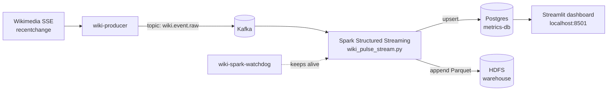

# Wiki Pulse Analytics

Watch **live Wikipedia activity** in a web dashboard. A small but complete streaming pipeline: events flow from Wikimedia's public feed, into Kafka, through Spark Structured Streaming, into Postgres, and onto a Streamlit dashboard.



---

## Quickstart (60 seconds)

```bash
docker compose up -d
# wait ~2 minutes the first time, then open:
open http://localhost:8501
```

That's it. The `wiki-spark-watchdog` container auto-launches the Spark streaming job inside `main-bigdata-service` within ~60 s — you do not need to start Spark manually.

You need **Docker** and roughly **8 GB free RAM**. Ports `8501` (dashboard), `9085` (Kafka UI), `9870` (HDFS UI), `4040` (Spark UI), and `55432` (Postgres) must be free.

---

## Day-to-day commands

| What you want | Command (run from repo root) |
|---|---|
| Bring everything up | `docker compose up -d` |
| Force-start Spark or replay Kafka backlog | `./my_code/scripts/start.sh` (env: `KAFKA_STARTING_OFFSETS=earliest`) |
| Stop the Spark streaming job (data preserved) | `./my_code/scripts/stop.sh` |
| Wipe rollups + Spark state and replay from Kafka | `./my_code/scripts/reset.sh` |
| Diagnose the whole stack | `./my_code/scripts/check.sh` (add `--verify` for CI-style strict mode) |
| Full shutdown | `docker compose down` |

Make scripts executable once: `chmod +x my_code/scripts/*.sh`.

---

## Ports and where things live

| URL | What |
|---|---|
| http://localhost:8501 | Streamlit dashboard (main entry point) |
| http://localhost:9085 | Kafka UI (browse topics + consumer groups) |
| http://localhost:9870 | HDFS NameNode UI |
| http://localhost:4040 | Spark Streaming UI (only while Spark runs) |
| localhost:55432 | Postgres `wiki_pulse_metrics` (rollup tables for the dashboard) |
| localhost:5432 | Hive metastore Postgres — **not** the dashboard DB |

Inside the `wikipulse_net` Docker network the hostnames are `kafka-server:9092`, `metrics-db:5432`, `main-bigdata-service`, and `zookeeper-server:2181`.

---

## How it works

| Stage | Code | Role |
|---|---|---|
| Ingest | [`my_code/producer/producer.py`](my_code/producer/producer.py) | Reads Wikimedia SSE feed, writes JSON to Kafka topic `wiki.event.raw`. Acks-all + idempotence-lite for safety. |
| Process | [`my_code/spark/wiki_pulse_stream.py`](my_code/spark/wiki_pulse_stream.py) | Two parallel structured streaming queries; broadcast-joins to a small lookup CSV on HDFS; minute-windowed counts; writes upserts to Postgres and Parquet to HDFS. |
| Schemas | [`my_code/schemas/metrics_init.sql`](my_code/schemas/metrics_init.sql) | `rollup_minute` (totals) + `rollup_action_minute` (per `type` / minor) — both indexed for the staleness probe. |
| Dashboard | [`my_code/dashboard/app.py`](my_code/dashboard/app.py) | Streamlit, auto-refreshing every `STREAMLIT_REFRESH_SECS` (default 15 s). |
| Resilience | [`my_code/scripts/spark_streaming_supervisor.sh`](my_code/scripts/spark_streaming_supervisor.sh) | Wraps `spark-submit` in a retry loop with exponential backoff and lookup-CSV self-heal. Runs inside `main-bigdata-service`. |
| Watchdog | `wiki-spark-watchdog` (compose service) | Pings `main-bigdata-service` every 30 s; if the supervisor died, relaunches it via `docker exec`. Survives container restarts and host reboots via `restart: unless-stopped`. |

Static enrichment file: [`my_code/static/wiki_domains.csv`](my_code/static/wiki_domains.csv) — uploaded to `hdfs:///data/static/wiki_domains.csv` on first start.

API reference for the SSE payload: [`wiki-apidoc-for-stream.json`](wiki-apidoc-for-stream.json).

---

## Configuration (environment variables)

### Producer

| Var | Default | Notes |
|---|---|---|
| `KAFKA_ACKS` | `all` | `1` is faster but loses data on broker crash. |
| `KAFKA_COMPRESSION` | `snappy` | `gzip` for smaller payloads at higher CPU; `lz4`, `none` also valid. |
| `KAFKA_ENABLE_IDEMPOTENCE` | `true` | Limits in-flight requests to 1 to preserve ordering on retry. Disable for higher throughput. |
| `KAFKA_LINGER_MS`, `KAFKA_BATCH_SIZE` | `20`, `32768` | Bigger batches = higher throughput, more latency. |
| `PRODUCER_HEARTBEAT_SECS` | `30` | INFO heartbeat with running totals; `0` to silence. |
| `PRODUCER_FLUSH_EVERY_SECS` | `10` | Bounded loss window if the container is killed. |

### Spark

| Var | Default | Notes |
|---|---|---|
| `KAFKA_STARTING_OFFSETS` | `latest` | `earliest` once after a reset to replay the topic. |
| `WIKIPULSE_TRIGGER` | `30 seconds` | Micro-batch cadence. |
| `WIKIPULSE_WINDOW` | `1 minute` | Aggregation window. |
| `WIKIPULSE_WATERMARK` | `2 minutes` | Late-arrival tolerance. |
| `KAFKA_MAX_OFFSETS_PER_TRIGGER` | `50000` | Cap per micro-batch (back-pressure). |
| `SPARK_SQL_SHUFFLE_PARTITIONS` | `8` | Bump to 64+ on a real cluster. |
| `SPARK_RUNTIME_VERSION` | `3.1.2` | Must match the Spark in the lab image; sets the `spark-sql-kafka` package version. |

### Dashboard

| Var | Default | Notes |
|---|---|---|
| `STREAMLIT_REFRESH_SECS` | `15` | UI auto-refresh interval. Hot queries cached just below this. |
| `WIKIPULSE_DASHBOARD_LOOKBACK_MINUTES` | `10080` (7 days) | Main chart's `window_end` filter. |
| `WIKIPULSE_DASHBOARD_STALE_MINUTES` | `15` | Banner threshold for "Spark may have stopped". |

---

## Scaling guide

The defaults target a laptop. When data volume goes up, change knobs in this order:

1. **Kafka throughput**. Raise `KAFKA_NUM_PARTITIONS` in [`docker-compose.yml`](docker-compose.yml) (default `3`, comfortable up to `12` even single-broker). Increase `KAFKA_LOG_RETENTION_BYTES` so the buffer can absorb backpressure. For a multi-broker cluster, raise `KAFKA_DEFAULT_REPLICATION_FACTOR` and `KAFKA_MIN_INSYNC_REPLICAS` to 3 / 2.
2. **Producer throughput**. Set `KAFKA_ENABLE_IDEMPOTENCE=false` and `KAFKA_LINGER_MS=50` for batched throughput. Keep `snappy` compression.
3. **Spark parallelism**. Set `SPARK_SQL_SHUFFLE_PARTITIONS=64` (or `2 * number_of_kafka_partitions`). Raise `KAFKA_MAX_OFFSETS_PER_TRIGGER` (e.g., `500000`) so each trigger does more work without falling behind. Set `WIKIPULSE_TRIGGER=10 seconds` for tighter latency.
4. **Postgres**. The schema already has indexes on `(window_end DESC)` and `(updated_at DESC)`. If `rollup_minute` grows past ~50M rows, switch it to a declaratively partitioned table by month and drop the un-indexed scan paths.
5. **Dashboard**. Keep `WIKIPULSE_DASHBOARD_LOOKBACK_MINUTES` modest (a few hours) on a busy DB; the cached fetchers fall back automatically.

`spark.sql.streaming.metricsEnabled=true` is on by default, so Prometheus can scrape per-query metrics on the Spark driver.

---

## Troubleshooting

| Symptom | Try |
|---|---|
| Dashboard shows "stale ~N min" banner | Wait 60 s — the watchdog auto-relaunches. If the banner persists 2+ min, run `./my_code/scripts/check.sh`. |
| `port is already allocated` | Another process is using one of the ports listed above. |
| `docker compose ps wiki-producer` keeps restarting | `docker compose logs wiki-producer --tail 50`. Most often Kafka isn't healthy yet — wait, or check `docker compose logs kafka`. |
| `rollup_action_minute` missing on an older volume | `docker compose exec -T metrics-db psql -U wikipulse -d wiki_pulse_metrics < my_code/schemas/metrics_addon_rollups.sql`, then `./my_code/scripts/start.sh`. |
| Spark log shows `Lookup CSV missing on HDFS` | The supervisor auto-uploads from `/opt/my_code/static/wiki_domains.csv`. If the file isn't there, the bind mount in `docker-compose.yml` is broken. |
| Producer reconnect spam | Wikimedia SSE has intermittent disconnects; the producer reconnects with backoff — normal. |
| Two Postgres databases confuse you | `metrics-db` (port `55432`, DB `wiki_pulse_metrics`) is the rollup store. `postgres-db` (port `5432`, DB `hive_metastore`) is Hive's metastore — never write rollups there. |

Need a deeper view: `docker compose logs -f wiki-spark-watchdog`, `tail /opt/my_code/logs/spark_supervisor.log` inside `main-bigdata-service`, or open the Spark UI at http://localhost:4040.

---

## Optional: register Hive tables for the Parquet files

Only useful for course/lab reports that need SQL over the Parquet partitions Spark writes to `hdfs:///user/cloudera/wiki_pulse/warehouse/wiki_window_agg`:

```bash
docker compose exec main-bigdata-service beeline \
  -u jdbc:hive2://localhost:10000 -n hive -p hivepassword \
  -f /opt/my_code/schemas/hive_ddl.sql

docker compose exec main-bigdata-service beeline \
  -u jdbc:hive2://localhost:10000 -n hive -p hivepassword \
  -e "USE wiki_pulse; MSCK REPAIR TABLE wiki_window_agg;"
```

---

## Project layout

```
├── docker-compose.yml
├── README.md
├── wiki-apidoc-for-stream.json
└── my_code/
    ├── producer/         producer.py + Dockerfile + requirements.txt
    ├── dashboard/        app.py + Dockerfile + requirements.txt
    ├── spark/            wiki_pulse_stream.py + requirements-driver.txt
    ├── static/           wiki_domains.csv (uploaded to HDFS on first start)
    ├── schemas/          metrics_init.sql, metrics_addon_rollups.sql, hive_ddl.sql
    └── scripts/          start.sh, stop.sh, reset.sh, check.sh,
                          spark_streaming_supervisor.sh
```

---

## Compliance

Use a descriptive `User-Agent`, back off on SSE disconnects, and follow the [Wikimedia Foundation Terms of Use](https://wikimediafoundation.org/wiki/Terms_of_Use). The default `SSE_USER_AGENT` baked into the producer satisfies these requirements.
